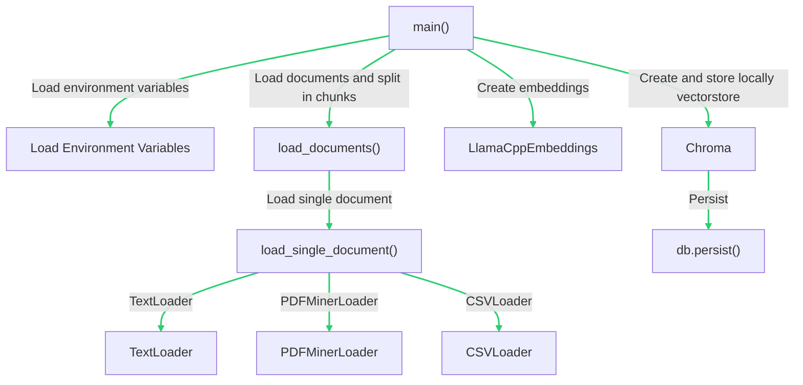
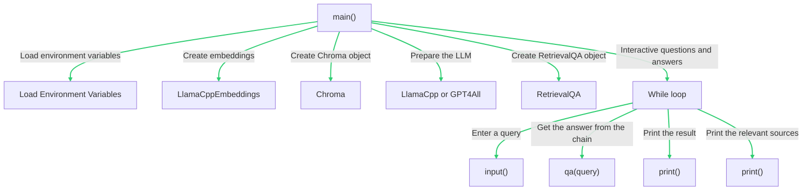

# hello-private-ChatGPT

PrivateGPT is a powerful tool that enables querying of documents using Large Language Models (LLMs) without the need for an internet connection. It ensures complete privacy as your data never leaves your local environment. This project is built upon the foundations of [LangChain](https://github.com/hwchase17/langchain), [GPT4All](https://github.com/nomic-ai/gpt4all), and [LlamaCpp](https://github.com/ggerganov/llama.cpp).

<video src="nebula_faster.mp4" controls title="Title"></video>

## Installation

1. Install the required Python libraries:

   ```shell
   pip install -r requirements.txt
   ```

2. Download and set up the model files:

   ```shell
   cp example.env .env
   mkdir models
   cd models
   curl https://gpt4all.io/models/ggml-gpt4all-j-v1.3-groovy.bin --output ggml-gpt4all-j-v1.3-groovy.bin
   url="https://huggingface.co/Pi3141/alpaca-native-7B-ggml/resolve/397e872bf4c83f4c642317a5bf65ce84a105786e/ggml-model-q4_0.bin"; curl -L $url -o $(basename $url)
   ```

3. Rename `example.env` to `.env` and adjust the variables as needed:

   ```
   MODEL_TYPE: LlamaCpp or GPT4All
   PERSIST_DIRECTORY: Directory for your vectorstore
   LLAMA_EMBEDDINGS_MODEL: Absolute path to your LlamaCpp compatible embeddings model
   MODEL_PATH: Path to your GPT4All or LlamaCpp compatible LLM
   MODEL_N_CTX: Maximum token limit for both embeddings and LLM models
   ```

## Usage

### Data Ingestion

1. Place your .txt, .pdf, or .csv files into the `source_documents` directory.
2. Run `python ingest.py` to ingest the data.

This process creates a `db` directory containing the local vectorstore. The time it takes depends on your dataset's size.

### Querying Documents

To query your documents, run:

```shell
python privateGPT.py
```

Enter your query when prompted. The system will process it and display the answer, along with the four sources from your documents used for context.

## Architecture

PrivateGPT uses LLMs and embeddings to interpret and answer queries about your documents. The embeddings are vector representations of words and the LLM is a language model trained on these embeddings. When a query is made, the LLM interprets the embeddings and generates a response.

- The `ingest.py` script loads your documents and splits them into chunks. It then creates embeddings using the `LlamaCppEmbeddings` class and stores them locally.



1. The `main()` function starts the process.
2. It loads the environment variables.
3. It calls the `load_documents()` function to load and split the documents into chunks. This function, in turn, calls the `load_single_document()` function to load a single document based on its file type (txt, pdf, or csv).
4. The `main()` function then creates embeddings using the `LlamaCppEmbeddings` class.
5. Finally, it creates a `Chroma` object from the documents and the embeddings, and persists it locally.

- The `privateGPT.py` script loads the embeddings and the LLM, and uses them to answer your queries.



1. The `main()` function starts the process.
2. It loads the environment variables.
3. It creates embeddings using the `LlamaCppEmbeddings` class.
4. It creates a `Chroma` object using the embeddings.
5. It prepares the Language Learning Model (LLM) based on the model type specified in the environment variables.
6. It creates a `RetrievalQA` object using the LLM and the retriever from the `Chroma` object.
7. It enters an interactive loop where it:
   - Takes a query from the user.
   - Gets the answer from the `RetrievalQA` object.
   - Prints the result.
   - Prints the relevant sources used for the answer.

## Limitations: Troubleshooting & Contributing

1. Chroma collection has fewer than 4 elements: Add more documents or modify the code to handle fewer documents in Chroma.

2. Llama.cpp error: Convert your Llama model to a newer format supporting memory mapping (mmap).

3. Seek assistance from developers of Chroma, LlamaCpp, and ggml libraries to resolve these issues.

## Acknowledgments

A big thanks to:

- We extend our gratitude to the teams behind LangChain, GPT4All, LlamaCpp, and ChromaDB for their invaluable contributions to this project. We also appreciate the broader open-source community for their ongoing support and feedback. Lastly, we

- imartinez for the original privateGPT project that inspired this one: https://github.com/imartinez/privateGPT

- LangChain for providing the essential tool that enables local loading of LLMs, ensuring data privacy.

- GPT4All for supplying the large language models that underpin this system's question-answering capabilities.

- LlamaCpp for the robust and efficient embedding models that convert text data into a format interpretable by the LLMs.

- ChromaDB for their compact and performant key-value storage solution.

- Diagram It Plug-in for ChatGpt-4.
