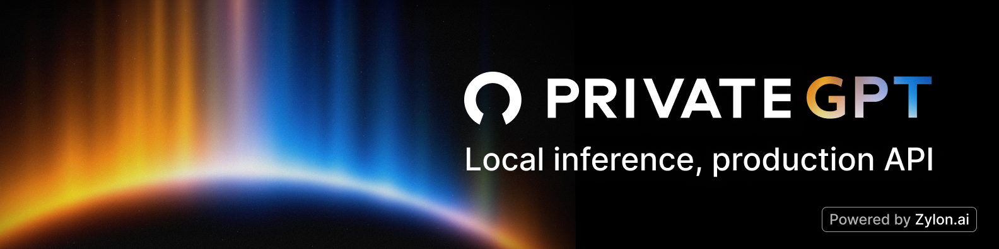
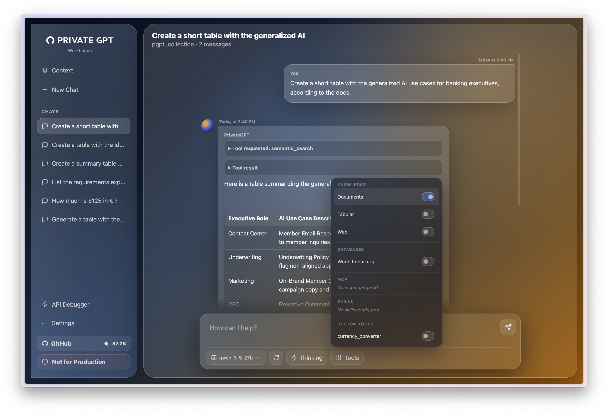
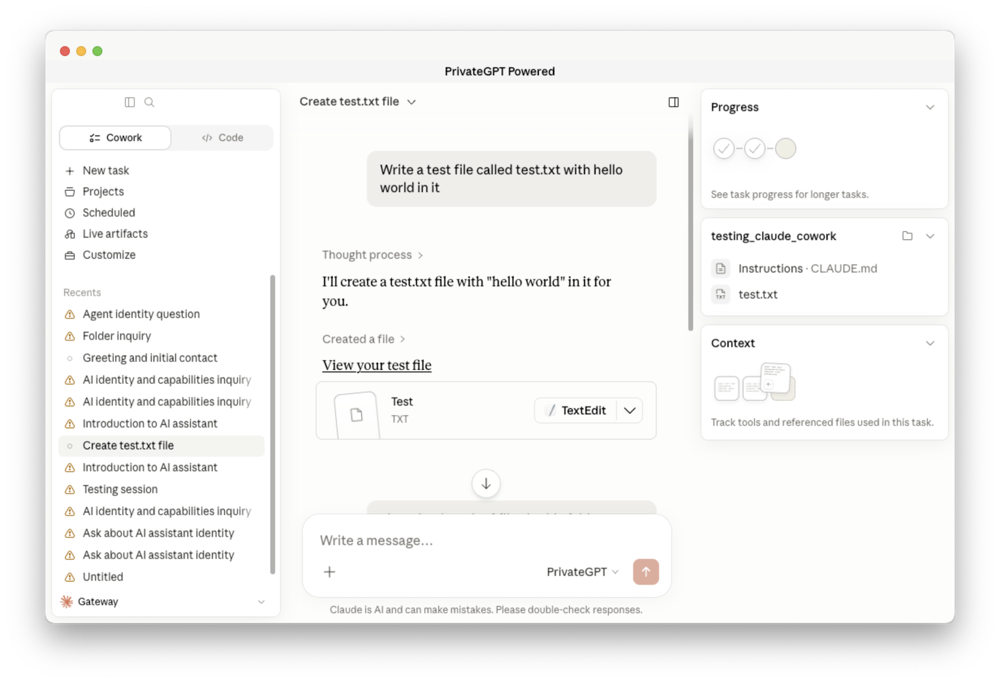
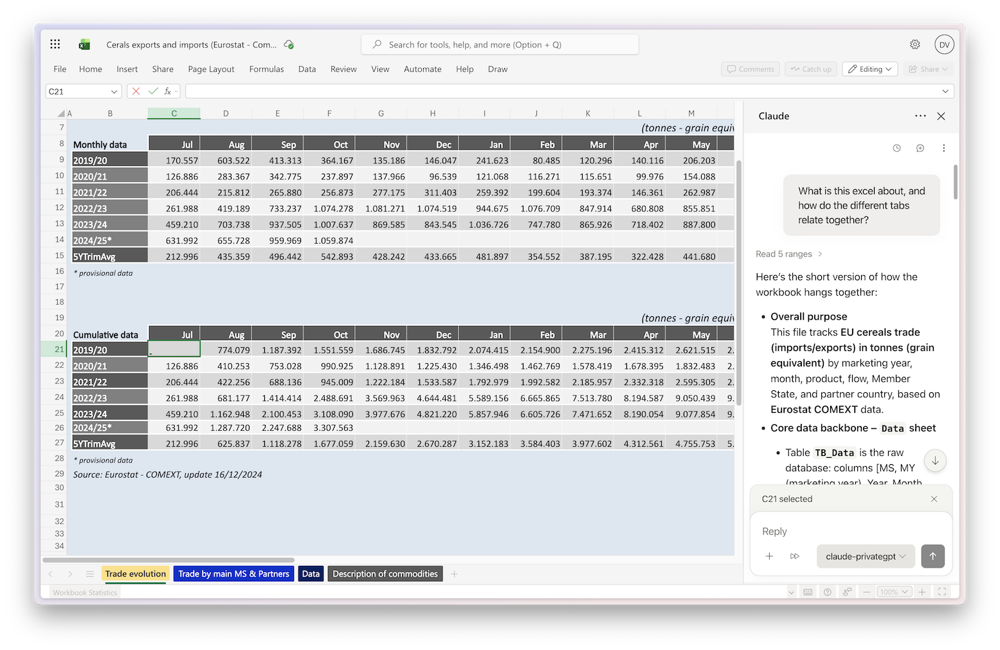
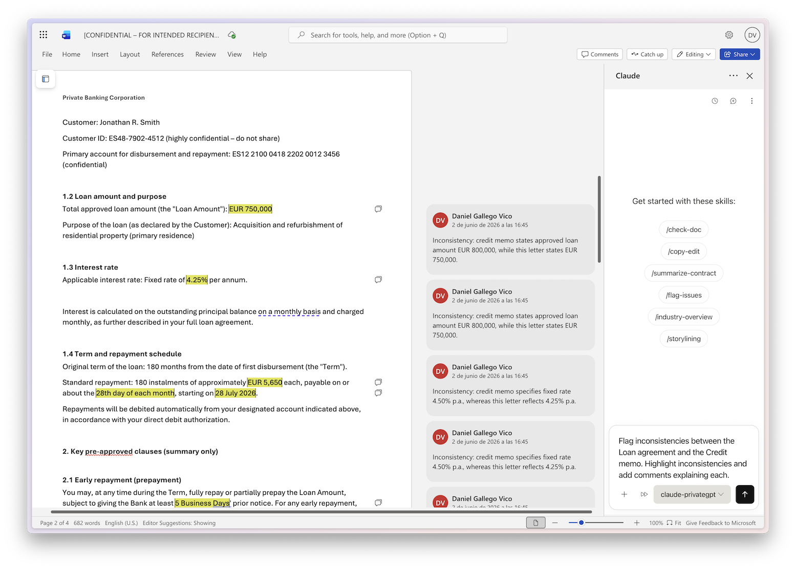
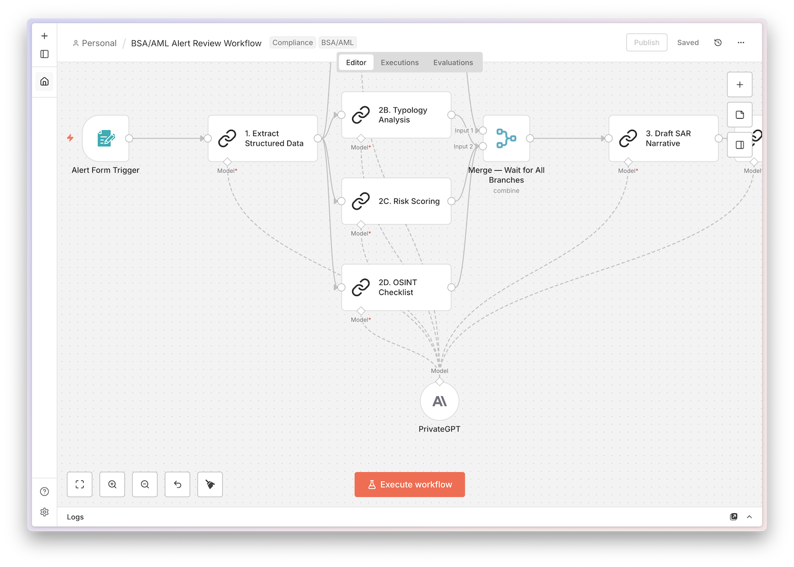
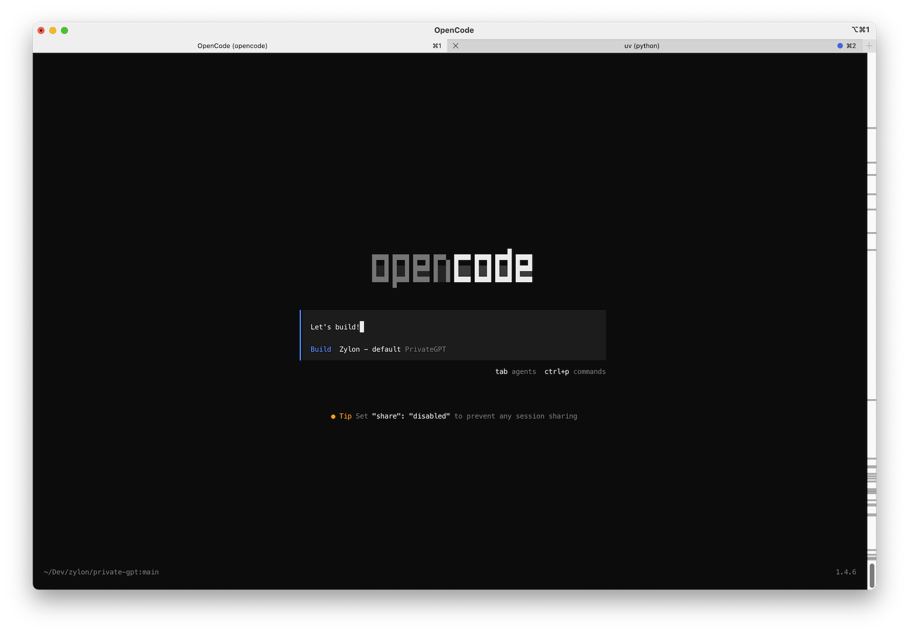
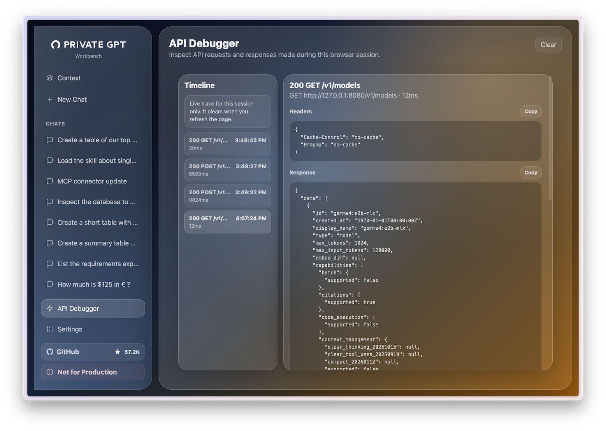
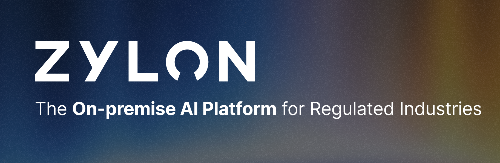

<div align="center">

**PrivateGPT is the open-source API layer that turns local models into production AI applications.**

[](https://github.com/zylon-ai/private-gpt/actions/workflows/tests.yml?query=branch%3Amain)
[](https://docs.privategpt.dev/)
[](https://discord.gg/F8KCFeZbkx)
[](https://twitter.com/ZylonPrivateGPT)

[Quickstart](#quickstart) · [Documentation](https://docs.privategpt.dev/) · [API Reference](https://docs.privategpt.dev/api-reference/api-reference) · [Discord](https://discord.gg/F8KCFeZbkx)

<a href="https://trendshift.io/repositories/8691" target="_blank"></a>

</div>

---

Running a model locally is only the first step. To build useful AI applications you need a set of higher-level building blocks. PrivateGPT provides that layer as an open-source API following the Claude API model — so you can build private AI products without rebuilding the same backend primitives from scratch, and without depending on cloud APIs.

Production-tested: [PrivateGPT powers Zylon](#privategpt-vs-zylon), the on-premise AI platform providing Private AI to enterprises across the globe.


```text
Your app / agent / workflow / UI
              |
        PrivateGPT API
              |
OpenAI-compatible inference server (Ollama, llama.cpp, vLLM, …)              
```

> PrivateGPT does **not** run models itself. It connects to any OpenAI-compatible inference server via `OPENAI_API_BASE`. If it implements `/v1/chat/completions` and `/v1/models`, it works.

PrivateGPT ships a built-in workbench UI for testing and demos, available at `/ui`. The API is the actual product.

---

## What PrivateGPT gives you

- Standard messages API (streaming, async, token counting)
- File and artifact ingestion
- Retrieval with citations and agentic RAG
- Built-in tools mirroring the Claude API (web search, web fetch, code execution)
- Custom tools and MCP connectors
- Structured access to databases and CSVs
- Embeddings and orchestration

---

## Quickstart

> For Docker, full installation options, and model configuration see the [full Quickstart guide](https://docs.privategpt.dev/getting-started/quickstart).

**Prerequisites:** You need a running OpenAI-compatible LLM server. [Ollama](https://docs.privategpt.dev/providers/ollama) is the easiest starting point.

**1. Install PrivateGPT**

```bash
# macOS
brew tap zylon-ai/tap
brew install private-gpt
```

```bash
# Linux
curl -LsSf https://astral.sh/uv/install.sh | sh

uv tool install --python 3.11 \
  --find-links https://wheels.privategpt.dev/packages/ \
  "private-gpt[core]"
```

```powershell
# Windows
powershell -ExecutionPolicy ByPass -c "irm https://astral.sh/uv/install.ps1 | iex"

uv tool install --python 3.11 `
  --find-links https://wheels.privategpt.dev/packages/ `
  "private-gpt[core]"
```

**2. Start your LLM server**

```bash
# Example with Ollama
ollama pull qwen3.5:35b         # LLM (~24 GB)
ollama pull mxbai-embed-large   # Embeddings (~670 MB)
ollama serve
```

**3. Run PrivateGPT**

```bash
# macOS / Linux
OPENAI_API_BASE=http://localhost:<llm-port>/v1 \
  OPENAI_EMBEDDING_API_BASE=http://localhost:<embedding-port>/v1 \
  private-gpt serve
```

```powershell
# Windows (PowerShell)
$env:OPENAI_API_BASE = "http://localhost:<llm-port>/v1"
$env:OPENAI_EMBEDDING_API_BASE = "http://localhost:<embedding-port>/v1"
private-gpt serve
```

**4. Open the UI**

Go to [http://localhost:8080/ui](http://localhost:8080/ui). The API is at `http://localhost:8080` and follows the [Anthropic API](https://docs.privategpt.dev/api-reference/api-reference) spec.



The UI is useful for:

- Sending messages.
- Selecting models from /v1/models.
- Uploading documents.
- Testing retrieval with citations.
- Enabling tools per chat.
- Configuring databases, MCP connectors, skills, and custom tools.
- Inspecting requests and responses through the API Debugger. 

This UI is a demonstrator, not the core product. Developers are expected to build their own applications on top of the API. That said, the UI is intentionally polished enough for demos, videos, internal pilots, and quick local usage.

---

## Integrations

| | | |
|:-------------------------:|:-------------------------:|:-------------------------:|
|[](./fern/docs/assets/claude_cowork_privategpt.png)<br/>**Claude Desktop / Cowork**|[](./fern/docs/assets/ms_excel_claude_privategpt.png)<br/>**Microsoft Excel Claude add-in**|[](./fern/docs/assets/ms_word_claude_privategpt.png)<br/>**Microsoft Word Claude add-in**|
|[](./fern/docs/assets/n8n_privategpt.png)<br/>**n8n**|[](./fern/docs/assets/opencode_privategpt.png)<br/>**OpenCode**|[](./fern/docs/assets/privategpt_workbench.png)<br/>**PrivateGPT Workbench**|

PrivateGPT works natively as the local backend for the tools developers and end users already use.

| Integration Guide | What it enables |
|---|---|
| **[Claude Code](https://docs.privategpt.dev/integrations/claude-code)** | Use your local models as the backend for agentic coding in the terminal |
| **[Claude Desktop / Cowork](https://docs.privategpt.dev/integrations/claude-desktop)** | Connect the Claude desktop app and Cowork to your private models |
| **[Claude for Microsoft 365](https://docs.privategpt.dev/integrations/claude-office)** | Run private AI inside Word, Excel, Outlook, and PowerPoint |
| **[OpenCode](https://docs.privategpt.dev/integrations/opencode)** | Local AI coding assistant in the terminal |


Any tool that works with a local OpenAI-compatible provider will also work with PrivateGPT. The list below is non-exhaustive.

| Tool | Link |
|---|---|
| n8n | [n8n.io](https://n8n.io) |
| OpenClaw | [openclaw.ai](https://openclaw.ai) |
| Hermes Agent | [hermes-agent.dev](https://hermes-agent.dev) |
| VS Code | [code.visualstudio.com](https://code.visualstudio.com) |
| Cline | [cline.bot](https://cline.bot) |


---

## Claude API compatibility

PrivateGPT follows the Claude API as the reference for modern AI application APIs. The goal is full coverage where it makes sense for a local, open-source layer.

| Area | Capability | Claude API | PrivateGPT |
|---|---|:---:|:---:|
| Models | Model selection | ✅ | ✅ |
| Messages | Messages API | ✅ | ✅ |
| Messages | Streaming | ✅ | ✅ |
| Messages | Batch / async processing | ✅ | ✅ async |
| Messages | Token counting | ✅ | ✅ |
| Knowledge | Files / artifacts | ✅ | ✅ |
| Knowledge | PDF and document ingestion | ✅ | ✅ |
| Knowledge | Retrieval with citations | ✅ | ✅ |
| Knowledge | Embeddings | ✅ | ✅ |
| Tools | Tool use | ✅ | ✅ |
| Tools | Tools in streaming | ✅ | ✅ |
| Tools | Built-in web search | ✅ | ✅ |
| Tools | Web extraction / fetch | ✅ | ✅ |
| Tools | Custom tools | ✅ | ✅ |
| Data | Database querying | Via tools | ✅ built-in |
| Data | CSV / tabular analysis | Via tools / code | ✅ built-in |
| Agents | MCP in the API | ✅ | ✅ |
| Agents | Remote MCP servers | ✅ | ✅ |
| Agents | Skills | ✅ | ⚙️ basic |
| Output | Structured outputs | ✅ | ✅ inference-dependent |
| Models | Vision | ✅ | ✅ model-dependent |
| Optimization | Prompt caching | ✅ | ❌ |
| Reasoning | Extended thinking | ✅ | ✅ |
| Platform | Token-based auth | ✅ | ✅ |
| Platform | OAuth / organizations | ✅ | ❌ |

✅ Supported · ⚙️ Partial / in progress · ❌ Not supported

Contributions are especially welcome in ⚙️ areas.

---

## Why PrivateGPT? A brief history

PrivateGPT started as a proof of concept in 2023: a script that let you chat with your documents, fully offline, with no data leaving your machine. It went viral on GitHub, crossed 50K stars, and became one of the most-watched AI repos of that year.

That early version made one thing clear: there was serious demand for private, local AI that worked without cloud dependencies.

PrivateGPT 1.0 is the evolution of that idea — rebuilt from the ground up as a proper API layer for private AI applications. 

<!-- Read the [PrivateGPT 1.0 launch post](https://blog.zylon.ai/privategpt-launch) for context on where it started and why. -->

<a href="https://www.star-history.com/?repos=zylon-ai%2Fprivate-gpt&type=date&legend=top-left">
 <picture>
   <source media="(prefers-color-scheme: dark)" srcset="https://api.star-history.com/chart?repos=zylon-ai/private-gpt&type=date&theme=dark&legend=top-left" />
   <source media="(prefers-color-scheme: light)" srcset="https://api.star-history.com/chart?repos=zylon-ai/private-gpt&type=date&legend=top-left" />
   
 </picture>
</a>

---

## How PrivateGPT compares

### vs Ollama, LM Studio, LocalAI, vLLM, llama.cpp

These projects make it possible to run and serve models locally. They answer: *how do I run a model?*

PrivateGPT answers the next question: *how do I build a useful AI application on top of that model?*

```text
Ollama / LM Studio / LocalAI / vLLM / llama.cpp  =  local inference layer
PrivateGPT                                        =  local AI application API layer
```

Use them together. Run your model with whichever inference server you prefer, then point PrivateGPT at it.

### vs Onyx, Open WebUI

Both are valuable, but they are app-first experiences focused on chat and enterprise search. PrivateGPT is API-first. It provides the standardized local backend underneath those products — not the final product itself.

```text
Onyx / Open WebUI  =  self-hosted AI applications
PrivateGPT         =  API layer for building self-hosted AI applications
```

---


## PrivateGPT vs Zylon

<a href="https://www.zylon.ai/" target="_blank"></a>

PrivateGPT is maintained by the team at [Zylon](https://zylon.ai/).

**PrivateGPT** is the open-source application API layer: messages, ingestion, tools, retrieval, citations, database access, tabular analysis, MCP, skills, and custom tools.

**Zylon** is the end-to-end AI Infrastructure orchestrating the hardware and software layers into a complete production platform for regulated organizations. On top of PrivateGPT, Zylon adds:

- Integrated inference server based on NVIDIA Triton + vLLM to run open-weight models.
- Concurrency, batch processing and load balancing capabilities to operate at scale.
- Kubernetes self-contained deployment with 20+ production services packaged and supported.
- CLI for installation, updates, model selection, and platform configuration.
- API gateway for governance and developer platform.
- Workspace application for non-technical end users.
- LDAP/Active Directory integration and RBAC user management.
- Telemetry, observability and operational monitoring.
- SIEM audit logs for compliance.
- SharePoint, Confluence, FTP, and Samba connectors.
- Disconnected (air-gapped) operation without external cloud dependencies.
- Integrated n8n Community Edition for workflow automation.

Use **PrivateGPT** if you want the open-source local AI application layer and developer API.

Use **Zylon** if you need the full enterprise AI infrastructure around it: deployment, governance, operations, user management, integrations, auditability, and support.

[Learn more at zylon.ai](https://zylon.ai) · [Book a demo](https://cal.com/zylon/demo?source=privategptreadme)

---

## Community and contributing

- [Discord](https://discord.gg/F8KCFeZbkx) — questions, show-and-tell, and release discussions
- [Documentation](https://docs.privategpt.dev/) — full reference, guides, and API docs
- [Issues](https://github.com/zylon-ai/private-gpt/issues) — bug reports and feature requests

Pull requests are welcome. 
