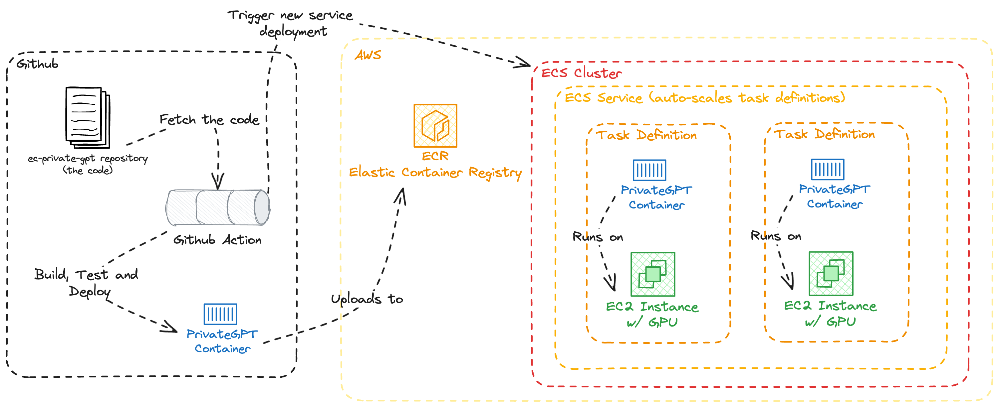

# Project's Architecture

## Context

The ec-private-gpt project follows the [PrivateGPT](https://docs.privategpt.dev/) project architecture to deploy an in-house RAG (Retrieval-Augmented Generation) model.

The project is designed to be a standalone service that can be used to generate text based on a context and a prompt. It is designed to be used in a microservice architecture, where the model is deployed as a service and can be accessed by other services through an API.

## Decision

The project is divided into the following components:

- **API**: The API is the entry point to the service. It is responsible for receiving requests, validating them, and forwarding them to the model for processing. It is also responsible for returning the results to the client.
- **LLM Embeddings Model**: The LLM Embeddings Model is responsible for generating embeddings for the input context (docs, spreadsheets, etc.)
- **Inference Model**: The Inference Model is responsible for generating text based on the input context and prompt. It uses the embeddings generated by the LLM Embeddings Model to generate the text.
- **Vectors Database**: The Vectors Database is responsible for storing the embeddings generated by the LLM Embeddings Model. It is used by the Inference Model to retrieve the embeddings for the input context.
- **Chat Frontend**: The Chat Frontend is a web interface that allows users to interact with the model.

### API

The API will be hosted and served on AWS. It will be containerized using Docker and deployed using ECS (Elastic Container Service).

Its code will be versioned and stored in a private repository on GitHub, and it will be built and deployed to AWS using GitHub Actions.

### LLM Embeddings and Inference Models

At the current stage, we will use OpenAI's GPT models for generating embeddings and inference. The models are hosted and served by OpenAI, and we will communicate with them using their API.

In the future, we may decide to train our own models and host them ourselves. In that case, we will use the same architecture as the API to host and serve the models.

### Vectors Database

We decided to use [Qdrant](https://qdrant.tech/) as our vectors database.

Qdrant is an open-source vector database that is designed to store and retrieve high-dimensional vectors efficiently. It is designed to be used with large-scale machine learning models, and it is optimized for fast retrieval of vectors.

At the current stage of development, we will use [Qdrant's cloud service](https://cloud.qdrant.io/) to store and retrieve the embeddings. In the future, we may decide to host our own instance of Qdrant.

### Chat Frontend

TBD.

## Consequences

The architecture is designed to be scalable and maintainable. It is designed to be used in a microservice architecture, where the model is deployed as a service and can be accessed by other services through an API.

The use of Qdrant as the vectors database allows us to store and retrieve the embeddings efficiently. It is optimized for fast retrieval of vectors, and it is designed to be used with large-scale machine learning models.

### Makes easier

- The architecture makes it easier to deploy and scale the model. Having a standalone service that is fully CI/CD integrated allows us to deploy new versions of the model quickly and easily.
- Using managed services (OpenAI models and Qdrant cloud service) allows us to focus on the development of the API and the Chat Frontend, without having to worry about the infrastructure of the models and the vectors database.
- The architecture allows us to use the same codebase and deployment process for the LLM Embeddings and Inference Models if we decide to host them ourselves in the future.

### Makes harder

- The architecture makes it harder to customize the models. Using managed services means that we are limited to the features and capabilities provided by the services. If we decide to host the models ourselves in the future, we will have to develop and maintain the infrastructure for the models.
- Privacy and PII: using managed services means that we'll be sending user data to third-party services. We'll have to ensure that we are compliant with privacy regulations and that we are not sending any sensitive data to the services.
