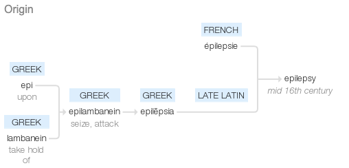

# Photosensitive Epilepsy

Last edited time: March 23, 2023 4:39 PM
Owner: Anonymous

## Steady State Visually Evoked Potentials and Photoparoxysmal Response Epilepsy: A Review of Special Considerations

**Lucas Steuber**, MA Applied Linguistics, MS CCC-SLP  |  **© 2020 Cognixion™** 

*Note: Not all deep dive content will be this in-depth, but this warranted particular consideration.*

---

**Table of Contents**

---

### **Introduction**

<aside>
🧠 Epilepsy is a broad term encompassing all seizures. Mid 16th century: from French épilepsie, or via late Latin from Greek epilēpsia, from epilambanein ‘seize, attack’, from epi ‘upon’ + lambanein ‘take hold of’. Also called the "falling sickness" off and on through history; some use the term "eleptiform" to describe seizures that involve convulsions, but all seizures are pathologically epileptic. So that's like saying my foot is foot-like.

</aside>

Fig. 1 - Etymology of the term Epilepsy, which dates to Ancient Greece

### Overview and Definition of Terms

---

[Table 1](Table%201%202e307f52d8334e579afbee8f6efa93d4.md)

Fig. 2: Disruptive (up arrow) or preventative (down arrow) effects of various triggers at specific wavelengths. Individuals with photoparoxysmal response (PPR, or photosensitivity) can experience a seizure within 500ms of viewing a target stimulus.

---

### Exclusions and Mitigating Factors

---

## Conclusions and Recommendations

- **Dravet Syndrome**
    
    Dravet Syndrome is caused by a rare mutation in the SCN1A mutation that causes speech and communication problems, frequent broken bones, heart abnormalities, and hypotonia (weak muscles). All of this would make them perfect candidates except for the hallmark of their illness: Frequent (as often as 90% of the time) photosensitive seizures.
    
- **Any physically mature subject with a past diagnosis of Juvenile Myoclonic Epilepsy**
    
    As these symptoms often persist into the late 20s and beyond - and even then are arguably mitigated only by anti-seizure medication - we must exercise extreme caution if we choose to proceed with such an individual.
    
- **Any individual who has suffered damage to the visual cortex in their occipital lobe.**
    
    Occipital lobe injuries after a traumatic or acquired brain injury (TBI vs ABI, generally a stroke) are the number one predictive factor for idiopathic photosensitive epilepsy in adults ("epileptogenesis"). At a minimum, specialties like neurology and optometry must make their own formal assessments and recommendations before any trial is performed.
    
- **We should cautiously engage with colorblind subjects.**
    
    If color vision deficits indicate that compromise red-green and blue-yellow perception (protoanomaly and deuteranomaly) to the extent that they prevent seizure activity, it is reasonable to assume the same may be true of response to SSVEPs - or minimally that the stimulus contrast must be adjusted. Fortunately, this is easy and risk-free to assess.
    
- **Research indicates considerable overlap between panic disorders and photosensitive epilepsy.**
    
    While the likelihood of an incident is low, consulting with a counselor on the topic - and having such services available - may be advised.
    
- **Visual acuity must be a selection factor.**
    
    While full blindness obviously cannot be overcome in the process of observation of SSVEPs, there is evidence that those with even advanced macular degeneration do respond as we would wish - albeit with significantly more time invested and at increased latency.
    
- **Some research indicates that binocular vision may be necessary to appropriately respond to SSVEPs.**
    
    In a case where subjects had prisms placed over a single eye to disrupt their vision, they either were unable to accurately perceive the stimulus or had much higher latency in doing so.
    
- **Substantial research indicates that those who experience albinism are not good subjects.**
    
    Numerous investigations show abnormalities in the retina, visual field, and optical nerves of albino mammals - including humans - as well as possible hemispheric translocation. Even basic stimulus patterns have not been successful with those with that condition, although no seizure activity was observed, so experimentally there is no harm. This phenomenon is technically referred to as Chediak-Higashi syndrome (CHS), which is "oculotaneous" in that visual stimulus appears to be structurally and neurologically rerouted.
    
- **While unrelated to epilepsy, there are some populations with visual comorbidities that may impact utility or latency of SSVEPs.**
    
    The most impacted of these are those experiencing Prader-Willi syndrome, a population our v1 headset was not intended to address regardless. However, potential occult lesions associated with multiple sclerosis may also be a detriment to efficacy, which will need to be studied further.
    
- **There are other populations with seizure comorbidities that lack specificity re: photosensitive triggers; however, the literature in aggregate suggests they do not. However, adult populations (read: v1 headset candidates) that merit consideration if a prospective user inquires includes:**
    - Trisomy 21 (Down Syndrome)
    - Spinal Muscular Atrophy Types 1 and 2 (Werdnig-Hoffman, Dubowitz)
    - Muscular Dystrophy
    - Turner Syndrome
    - Kleinfelter Syndrome
    - Fragile X
    - Prader-Willi
    - 22q.11 Deletion (DiGeorge Syndrome)
    - FOXG1 Syndrome
    - CDKL5 Deficiency
    - Landau-Kleffner Syndrome
    - Trisomy 12P
    - Cardio-Facio-Cutaneous (CFC) Syndrome
    - Mowat-Wilson Syndrome
    - Huntingtons Disease (Late Stage)
    - Foix Chavany Marie Syndrome
- The above disorders tend to have individuals who live to the age of physical maturity and have a greater than 75% comorbid incidence of epilepsy. However, there is no literature in any of the listed cases that indicates a photoparoxysmal trigger. My recommendation is that none of those groups be ruled out, but extra care and consultation should be performed in anticipation of a trial. For more information on any of those groups and many more, contact me to reference my addressable populations work.

/ai

---

## Future Research

While this document has focused on the question that represents the greatest humane urgency and liability exposure, photosensitive epilepsy is far from the only disqualifying factor; in fact we are quite lucky that Dravet Syndrome and Albinism are the only clear (e.g. non-ideopathic) risk populations. Future research will address concerns such as:

- Conditions prone to dermal abrasion or adverse autoimmune response to chosen materials;
- Diagnoses with symptoms causing subcutaneous electrical activity that may preclude obtaining an adequate signal-to-noise ratio;
- Macro- and microcephaly and other craniofacial characteristics that could make fitting a device impossible;
- Involuntary muscle movement (chorea) extreme enough to overcome planned design countermeasures;
- Neck and trunk strength compromised to a degree that prosthetics cannot overcome;
- Individuals limited to eye movement only, assuming eye tracking is not a component of the final design;
- Potential users experiencing rare perceptual disorders secondary to cerebrovascular accidents, such as hemiagnosia ("side blindness");
- Candidates who have sustained structural injuries to the occipital lobe that impairs placement of electrodes;
- For a possible future iteration, equivalent research must be documented for populations who have not or are unlikely to reach full physical maturity;
- And finally - although I wager this risk inventory is lacking undiscovered factors - potential users with profound or specific cognitive impairments that preclude both literacy and the capacity to meaningfully assess and interact with their environment.

---

## References

*Links, and PDFs where possible, can be found in the [private Cognixion Mendeley account](https://www.mendeley.com/community/cognixion/); contact me for access if you do not have it. Also, I am **not** going through and APA tab-indenting 64 citations, so you're just going to have to deal with that.* **😎**

Akanuma, N., Hara, E., Adachi, N., Hara, K., & Koutroumanidis, M. (2008). Psychiatric comorbidity in adult patients with idiopathic generalized epilepsy. Epilepsy and Behavior, 13(1), 248–251. https://doi.org/10.1016/j.yebeh.2008.01.006

Binnie, C. D., Estevez, O., Kasteleijn-Nolst Trenité, D. G. A., & Peters, A. (1984). Colour and photosensitive epilepsy. Electroencephalography and Clinical Neurophysiology, 58(5), 387–391. https://doi.org/10.1016/0013-4694(84)90134-2

Binnie, C. D., Findlay, J., & Wilkins, A. J. (1985). Mechanisms of epileptogenesis in photosensitive epilepsy implied by the effects of moving patterns. Electroencephalography and Clinical Neurophysiology, 61(1), 1–6. https://doi.org/10.1016/0013-4694(85)91065-X

Brazzo, D., Di Lorenzo, G., Bill, P., Fasce, M., Papalia, G., Veggiotti, P., & Seri, S. (2011). Abnormal visual habituation in pediatric photosensitive epilepsy. Clinical Neurophysiology, 122(1), 16–20. https://doi.org/10.1016/j.clinph.2010.06.002

Brinciotti, M., Matricardi, M., Pelliccia, A., & Trasatti, G. (1994). Pattern Sensitivity and Photosensitivity in Epileptic Children with Visually Induced Seizures. Epilepsia, 35(4), 842–849. https://doi.org/10.1111/j.1528-1157.1994.tb02521.x

Capovilla, G., Gambardella, A., Rubboli, G., Beccaria, F., Montagnini, A., Aguglia, U., Canevini, M. P., Casellato, S., Granata, T., Paladin, F., Romeo, A., Stranci, G., Tinuper, P., Veggiotti, P., Avanzini, G., & Tassinari, C. A. (2006). Suppressive efficacy by a commercially available blue lens on PPR in 610 photosensitive epilepsy patients. Epilepsia, 47(3), 529–533. https://doi.org/10.1111/j.1528-1167.2006.00463.x

Capovilla, G., Striano, P., Gambardella, A., Beccaria, F., Hirsch, E., Casellato, S., Romeo, A., Rubboli, G., Sofia, V., Teutonico, F., Valenti, M. P., & Striano, S. (2009). Eyelid fluttering, typical EEG pattern, and impaired intellectual function: A homogeneous epileptic condition among the patients presenting with eyelid myoclonia. Epilepsia, 50(6), 1536–1541. https://doi.org/10.1111/j.1528-1167.2008.02002.x

Chaix, Y., Daquin, G., Monteiro, F., Villeneuve, N., Laguitton, V., & Genton, P. (2003). Absence epilepsy with onset before age three years: A heterogeneous and often severe condition. Epilepsia, 44(7), 944–949. https://doi.org/10.1046/j.1528-1157.2003.54902.x

Coleman, J., Sydnor, C. F., Wolbarsht, M. L., & Bessler, M. (1979). Abnormal visual pathways in human albinos studied with visually evoked potentials. Experimental Neurology, 65(3), 667–679. https://doi.org/10.1016/0014-4886(79)90052-9

COPENHAVER, R. M., & PERRY, N. W. (1964). Factors Affecting Visually Evoked Cortical Potentials Such As Impaired Vision of Varying Etiology. Investigative Ophthalmology, 3, 665–675.

Covanis, A. (2005). Photosensitivity in idiopathic generalized epilepsies. Epilepsia, 46(SUPPL. 9), 67–72. https://doi.org/10.1111/j.1528-1167.2005.00315.x

Covanis, A., Stodieck, S. R. G., & Wilkins, A. J. (2004). Treatment of Photosensitivity. Epilepsia, 45(SUPPL. 1), 40–45. https://doi.org/10.1111/j.0013-9580.2004.451006.x

Creel, D. J., Bendel, C. M., Wiesner, G. L., Wirtschafter, J. D., Arthur, D. C., & King, R. A. (1986). Abnormalities of the Central Visual Pathways in Prader–Willi Syndrome Associated with Hypopigmentation. New England Journal of Medicine, 314(25), 1606–1609. https://doi.org/10.1056/NEJM198606193142503

Creel, D., Boxer, L. A., & Fauci, A. S. (1983). Visual and auditory anomalies in Chediak-Higashi syndrome. Electroencephalography and Clinical Neurophysiology, 55(3), 252–257. https://doi.org/10.1016/0013-4694(83)90202-X

De Haan, G. J., Trenité, D. K. N., Stroink, H., Parra, J., Voskuyl, R., Van Kempen, M., Lindhout, D., & Bertram, E. (2005). Monozygous twin brothers discordant for photosensitive epilepsy: First report of possible visual priming in humans. Epilepsia, 46(9), 1545–1549. https://doi.org/10.1111/j.1528-1167.2005.44104.x

DOMINO, E. F., CORSSEN, G., & SWEET, R. B. (1963). Effects of Various General Anesthetics on the Visually Envoked Response. Anesthesia and Analgesia, 42, 735–747. https://journals.lww.com/anesthesia-analgesia/Citation/1963/11000/EFFECTS_OF_VARIOUS_GENERAL_ANESTHETICS_ON_THE.28.aspx

Erba, G. (2001). Preventing seizures from “pocket monsters”: A way to control reflex epilepsy. In Neurology (Vol. 57, Issue 10, pp. 1747–1748). https://doi.org/10.1212/WNL.57.10.1747

Feinsod, M., Hoyt, W. F., Wilson, W. B., & Spire, J. P. (1976). Visually Evoked Response: Use in Neurologic Evaluation of Posttraumatic Subjective Visual Complaints. Archives of Ophthalmology, 94(2), 237–240. https://doi.org/10.1001/archopht.1976.03910030113007

Freeman, R. D., & Thibos, L. N. (1975). Visual evoked responses in humans with abnormal visual experience. The Journal of Physiology, 247(3), 711–724. https://doi.org/10.1113/jphysiol.1975.sp010953

Fylan, F., & Harding, G. F. A. (1998). Erratum: The effect of television frame rate on EEG abnormalities in photosensitive and pattern-sensitive epilepsy (Epilepsia (October 1997) 38 (1124-1131)). Epilepsia, 39(4), 453. https://doi.org/10.1111/j.1528-1157.1998.tb01403.x

Green, J. B. (1969). Photosensitive Epilepsy: The Electroretinogram and Visually Evoked Response. Archives of Neurology, 20(2), 191–198. https://doi.org/10.1001/archneur.1969.00480080091011

Guerrini, R., & Genton, P. (2004). Epileptic Syndromes and Visually Induced Seizures. Epilepsia, 45(SUPPL. 1), 14–18. https://doi.org/10.1111/j.0013-9580.2004.451011.x

Halliday, A. M., McDonald, W. I., & Mushin, J. (1973). Visual evoked response in diagnosis of multiple sclerosis. British Medical Journal, 4(5893), 661–664. https://doi.org/10.1136/bmj.4.5893.661

Harden, A., Pampiglione, G., & Picton-Robinson, N. (1973). Electroretinogram and visual evoked response in a form of “neuronal lipidosis” with diagnostic EEG features. Journal of Neurology, Neurosurgery, and Psychiatry, 36(1), 61–67. https://doi.org/10.1136/jnnp.36.1.61

Harding, G. F. A., Edson, A., & Jeavons, P. M. (1997). Persistence of photosensitivity. Epilepsia, 38(6), 663–669. https://doi.org/10.1111/j.1528-1157.1997.tb01235.x

Harding, G. F. A., & Fylan, F. (1999). Two visual mechanisms of photosensitivity. Epilepsia, 40(10), 1446–1451. https://doi.org/10.1111/j.1528-1157.1999.tb02018.x

Harding, G. F. A., Jeavons, P. M., & Edson, A. S. (1994). Video Material and Epilepsy. Epilepsia, 35(6), 1208–1216. https://doi.org/10.1111/j.1528-1157.1994.tb01791.x

Harding, G. (1994). Photosensitivity: a vestigial echo? The first Grey Walter lecture. International Journal of Psychophysiology, 16(2–3), 273–279. https://doi.org/10.1016/0167-8760(89)90054-8

Hermes, D., Kasteleijn-Nolst Trenité, D. G. A., & Winawer, J. (2017). Gamma oscillations and photosensitive epilepsy. In Current Biology (Vol. 27, Issue 9, pp. R336–R338). https://doi.org/10.1016/j.cub.2017.03.076

Herrmann, C. S., & Demiralp, T. (2005). Human EEG gamma oscillations in neuropsychiatric disorders. Clinical Neurophysiology, 116(12), 2719–2733. https://doi.org/10.1016/j.clinph.2005.07.007

Höfler, J., Unterberger, I., Dobesberger, J., Kuchukhidze, G., Walser, G., & Trinka, E. (2014). Seizure outcome in 175 patients with juvenile myoclonic epilepsy - A long-term observational study. Epilepsy Research, 108(10), 1817–1824. https://doi.org/10.1016/j.eplepsyres.2014.09.008

HORTON, R. W., & MELDRUM, B. S. (1973). Seizures induced by allylglycine, 3‐mercaptopropionic acid and 4‐deoxypyridoxine in mice and photosensitive baboons, and different modes of inhibition of cerebral glutamic acid decarboxylase. British Journal of Pharmacology, 49(1), 52–63. https://doi.org/10.1111/j.1476-5381.1973.tb08267.x

Kaplan, P. W., Tusa, R. J., Shankroff, J., Heller, J., & Moser, H. W. (1993). Visual evoked potentials in adrenolukodystrophy: A trial with glycerol trioleate and Lorenzo oil. Annals of Neurology, 34(2), 169–174. https://doi.org/10.1002/ana.410340212

Kasteleijn-Nolst Trenité, D. G. A., Genton, P., Parain, D., Masnou, P., Steinhoff, B. J., Jacobs, T., Pigeolet, E., Stockis, A., & Hirsch, E. (2007). Evaluation of brivaracetam, a novel SV2A ligand, in the photosensitivity model. Neurology, 69(10), 1027–1034. https://doi.org/10.1212/01.wnl.0000271385.85302.55

Kato, M., Nakagami, T., & Watanabe, I. (1991). Visual evoked potentials in macular hole. Documenta Ophthalmologica, 76(4), 341–349. https://doi.org/10.1007/BF00142672

Kolb, H., Ralph, N., & Eduardo, F. (1995). Webvision: The Organization of the Retina and Visual System [Internet]. 1995.

Langs, G., Fabisch, K., & Fabisch, H. (2000). A case of comorbidity between panic disorder and photosensitive epilepsy. Psychopathology, 33(5), 271–274. https://doi.org/10.1159/000029157

Lopes da Silva, F. H., & Harding, G. F. A. (2011). Transition to seizure in photosensitive epilepsy. Epilepsy Research, 97(3), 278–282. https://doi.org/10.1016/j.eplepsyres.2011.10.022

Löscher, W., & Brandt, C. (2010). Prevention or modification of epileptogenesis after brain insults: Experimental approaches and translational research. In Pharmacological Reviews (Vol. 62, Issue 4, pp. 668–700). https://doi.org/10.1124/pr.110.003046

Manoj, K., Sharma, R. G., & Kumar, S. R. (1991). Visual evoked response in macular diseases. In Indian journal of ophthalmology (Vol. 39, Issue 2, pp. 62–64). http://www.ijo.in/article.asp?issn=0301-4738;year=2009;volume=57;issue=4;spage=257;epage=266;aulast=Agarwal

Meienberg, O., Flammer, J., & Ludin, H. P. (1982). Subclinical visual field defects in multiple sclerosis - Demonstration and quantification with automated perimetry, and comparison with visually evoked potentials. Journal of Neurology, 227(3), 125–133. https://doi.org/10.1007/BF00313566

Meienberg, O., Hemphill, G., Rosenberg, M., & Hoyt, W. F. (1980). Visually Evoked Response Asymmetries in a Family with Congenital Nystagmus: Possible Evidence of Abnormal Visual Projections. Archives of Neurology, 37(11), 697–698. https://doi.org/10.1001/archneur.1980.00500600045008

Moutaouakil, F., El Otmani, H., Fadel, H., El Moutawakkil, B., & Slassi, I. (2010). Benign myoclonic epilepsy of infancy evolving to jeavons syndrome. Pediatric Neurology, 43(3), 213–216. https://doi.org/10.1016/j.pediatrneurol.2010.05.006

Parra, J., Kalitzin, S. N., Iriarte, J., Blanes, W., Velis, D. N., & Lopes da Silva, F. H. (2003). Gamma-band phase clustering and photosensitivity: Is there an underlying mechanism common to photosensitive epilepsy and visual perception? Brain, 126(5), 1164–1172. https://doi.org/10.1093/brain/awg109

Porciatti, V., Bonanni, P., Fiorentini, A., & Guerrini, R. (2000). Lack of cortical contrast gain control in human photosensitive epilepsy. Nature Neuroscience, 3(3), 259–263. https://doi.org/10.1038/72972

Richey, E. T., Kooi, K. A., & Tourtellotte, W. W. (1971). Visually evoked responses in multiple sclerosis. Journal of Neurology, Neurosurgery, and Psychiatry, 34(3), 275–280. https://doi.org/10.1136/jnnp.34.3.275

Srebro, R. (1978). The Visually Evoked Response: Binocular Facilitation and Failure When Binocular Vision Is Disturbed. Archives of Ophthalmology, 96(5), 839–844. https://doi.org/10.1001/archopht.1978.03910050445009

Stephani, U., Tauer, U., Koeleman, B., Pinto, D., Neubauer, B. A., & Lindhout, D. (2004). Genetics of Photosensitivity (Photoparoxysmal Response): A Review. Epilepsia, 45(s1), 19–23. https://doi.org/10.1111/j.0013-9580.2004.451008.x

Striano, S., Capovilla, G., Sofia, V., Romeo, A., Rubboli, G., Striano, P., & Trenité, D. K. N. (2009). Eyelid myoclonia with absences (Jeavons syndrome): A well-defined idiopathic generalized epilepsy syndrome or a spectrum of photosensitive conditions? Epilepsia, 50(SUPPL. 5), 15–19. https://doi.org/10.1111/j.1528-1167.2009.02114.x

Takahashi, Y., Fujiwara, T., Yagi, K., & Seino, M. (1999). Photosensitive epilepsies and pathophysiologic mechanisms of the photoparoxysmal response. Neurology, 53(5), 926–932. https://doi.org/10.1212/wnl.53.5.926

Takahashi, Y., Fujiwara, T., Yagi, K., & Seino, M. (1999). Wavelength Dependence of Photoparoxysmal Responses in Photosensitive Patients with Epilepsy. Epilepsia, 40(s4), 23–27. https://doi.org/10.1111/j.1528-1157.1999.tb00902.x

Takahashi, Y., Sato, T., Goto, K., Fujino, M., Fujiwara, T., Yamaga, M., Isono, H., & Kondo, N. (2001). Optical filters inhibiting television-induced photosensitive seizures. Neurology, 57(10), 1767–1773. https://doi.org/10.1212/WNL.57.10.1767

Takahashi, Y., Watanabe, M., Fujiwara, T., Yagi, K., Kondo, N., Orii, T., & Seino, M. (1997). Two different pathological conditions of photoparoxysmal responses in hereditary dentatorubral-pallidoluysian atrophy. Brain and Development, 19(4), 285–289. https://doi.org/10.1016/S0387-7604(97)00022-3

Trinka, E., Kienpointner, G., Unterberger, I., Luef, G., Bauer, G., Doering, L. B., & Doering, S. (2006). Psychiatric comorbidity in juvenile myoclonic epilepsy. Epilepsia, 47(12), 2086–2091. https://doi.org/10.1111/j.1528-1167.2006.00828.x

Vermeulen, J., Kalitzin, S., Parra, J., Dekker, E., Vossepoel, A., & da Silva, F. L. (2008). Non-provocative diagnostics of photosensitivity using visual evoked potentials. Clinical Neurophysiology, 119(4), 842–852. https://doi.org/10.1016/j.clinph.2007.11.177

Vialatte, F. B., Maurice, M., Dauwels, J., & Cichocki, A. (2010). Steady-state visually evoked potentials: Focus on essential paradigms and future perspectives. In Progress in Neurobiology (Vol. 90, Issue 4, pp. 418–438). https://doi.org/10.1016/j.pneurobio.2009.11.005

Villas, N., Meskis, M. A., & Goodliffe, S. (2017). Dravet syndrome: Characteristics, comorbidities, and caregiver concerns. Epilepsy and Behavior, 74, 81–86. https://doi.org/10.1016/j.yebeh.2017.06.031

Visani, E., Varotto, G., Binelli, S., Fratello, L., Franceschetti, S., Avanzini, G., & Panzica, F. (2010). Photosensitive epilepsy: Spectral and coherence analyses of EEG using 14 Hz intermittent photic stimulation. Clinical Neurophysiology, 121(3), 318–324. https://doi.org/10.1016/j.clinph.2009.12.003

Waltz, S., & Stephani, U. (2000). Inheritance of photosensitivity. Neuropediatrics, 31(2), 82–85. https://doi.org/10.1055/s-2000-7478

Wassenaar, M., Kasteleijn-Nolst Trenité, D. G. A., De Haan, G. J., Carpay, J. A., & Leijten, F. S. S. (2014). Seizure precipitants in a community-based epilepsy cohort. Journal of Neurology, 261(4), 717–724. https://doi.org/10.1007/s00415-014-7252-8

Wilkins, A. J., Binnie, C. D., & Darby, C. E. (1980). Visually-induced seizures. In Progress in Neurobiology (Vol. 15, Issue 2, pp. 85–117). https://doi.org/10.1016/0301-0082(80)90004-0

Wolf, P., & Goosses, R. (1986). Relation of photosensitivity to epileptic syndromes. Journal of Neurology, Neurosurgery and Psychiatry, 49(12), 1386–1391. https://doi.org/10.1136/jnnp.49.12.1386

Zifkin, B. G., & Trenite, D. K. N. (2000). Reflex epilepsy and reflex seizures of the visual system: A clinical review. Epileptic Disorders, 2(3), 129–136. http://www.jle.com/en/revues/mca/e-docs/comment_obtenir_un_reglage_optimal_dun_stimulateur_cardiaque__278131/article.phtml?tab=texte

Zifkin, B. G., & Inoue, Y. (2004). Visual Reflex Seizures Induced by Complex Stimuli. Epilepsia, 45(SUPPL. 1), 27–29. https://doi.org/10.1111/j.0013-9580.2004.451005.x

# Clinical Guidance Document for the Cognixion ONE Speech Generating Device

This document provides clinical guidance on the use of the Cognixion ONE speech generating device. It is written by a speech-language pathologist and is intended for use by healthcare professionals who work with individuals who have communication impairments.

## Introduction

The Cognixion ONE is a speech generating device that uses brain computer interface (BCI) technology to allow individuals with communication impairments to communicate using their thoughts. The device is designed for use by individuals who are unable to communicate effectively using traditional methods of communication, such as speech or writing.

## Best Practices for using the Cognixion ONE

### Assessment

Before using the Cognixion ONE, it is important to assess the individual's communication abilities and needs. This should include an assessment of their cognitive abilities, motor function, and language skills. This information will help to determine if the Cognixion ONE is an appropriate device for the individual and to develop a communication plan that meets their specific needs.

### Training

Training is essential for successful use of the Cognixion ONE. This should include training on how to use the device, as well as training on how to set up and customize the device to meet the individual's specific needs. It is important that the individual and their caregivers receive ongoing training and support to ensure that they are able to use the device effectively.

### Customization

The Cognixion ONE can be customized to meet the individual's specific needs. This includes customizing the device's user interface, as well as programming the device to include specific vocabulary and phrases that are relevant to the individual. It is important to work closely with the individual and their caregivers to ensure that the device is customized in a way that meets their specific needs.

### Maintenance

Regular maintenance is important for ensuring that the Cognixion ONE continues to function effectively. This includes regular cleaning and calibration of the device, as well as regular software updates to ensure that the device is running the latest version of the software.

## Conclusion

The Cognixion ONE is a powerful tool for individuals with communication impairments. By following best practices for assessment, training, customization, and maintenance, healthcare professionals can help their patients to use the device effectively and to communicate more effectively with the world around them.

## References

itton, V., & Genton, P. (2003). Absence epilepsy with onset before age three years: A heterogeneous and often severe condition. Epilepsia, 44(7), 944–949. [https://doi.org/10.1046/j.1528-1157.2003.54902.x](https://doi.org/10.1046/j.1528-1157.2003.54902.x)

Coleman, J., Sydnor, C. F., Wolbarsht, M. L., & Bessler, M. (1979). Abnormal visual pathways in human albinos studied with visually evoked potentials. Experimental Neurology, 65(3), 667–679. [https://doi.org/10.1016/0014-4886(79)90052-9](https://doi.org/10.1016/0014-4886(79)90052-9)

COPENHAVER, R. M., & PERRY, N. W. (1964). Factors Affecting Visually Evoked Cortical Potentials Such As Impaired Vision of Varying Etiology. Investigative Ophthalmology, 3, 665–675.

Covanis, A. (2005). Photosensitivity in idiopathic generalized epilepsies. Epilepsia, 46(SUPPL. 9), 67–72. [https://doi.org/10.1111/j.1528-1167.2005.00315.x](https://doi.org/10.1111/j.1528-1167.2005.00315.x)

Covanis, A., Stodieck, S. R. G., & Wilkins, A. J. (2004). Treatment of Photosensitivity. Epilepsia, 45(SUPPL. 1), 40–45. [https://doi.org/10.1111/j.0013-9580.2004.451006.x](https://doi.org/10.1111/j.0013-9580.2004.451006.x)

Creel, D. J., Bendel, C. M., Wiesner, G. L., Wirtschafter, J. D., Arthur, D. C., & King, R. A. (1986). Abnormalities of the Central Visual Pathways in Prader–Willi Syndrome Associated with Hypopigmentation. New England Journal of Medicine, 314(25), 1606–1609. [https://doi.org/10.1056/NEJM198606193142503](https://doi.org/10.1056/NEJM198606193142503)

Creel, D., Boxer, L. A., & Fauci, A. S. (1983). Visual and auditory anomalies in Chediak-Higashi syndrome. Electroencephalography and Clinical Neurophysiology, 55(3), 252–257. [https://doi.org/10.1016/0013-4694(83)90202-X](https://doi.org/10.1016/0013-4694(83)90202-X)

De Haan, G. J., Trenité, D. K. N., Stroink, H., Parra, J., Voskuyl, R., Van Kempen, M., Lindhout, D., & Bertram, E. (2005). Monozygous twin brothers discordant for photosensitive epilepsy: First report of possible visual priming in humans. Epilepsia, 46(9), 1545–1549. [https://doi.org/10.1111/j.1528-1167.2005.44104.x](https://doi.org/10.1111/j.1528-1167.2005.44104.x)

DOMINO, E. F., CORSSEN, G., & SWEET, R. B. (1963). Effects of Various General Anesthetics on the Visually Envoked Response. Anesthesia and Analgesia, 42, 735–747. [https://journals.lww.com/anesthesia-analgesia/Citation/1963/11000/EFFECTS_OF](https://journals.lww.com/anesthesia-analgesia/Citation/1963/11000/EFFECTS_OF)