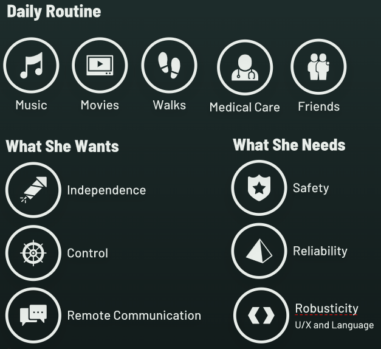
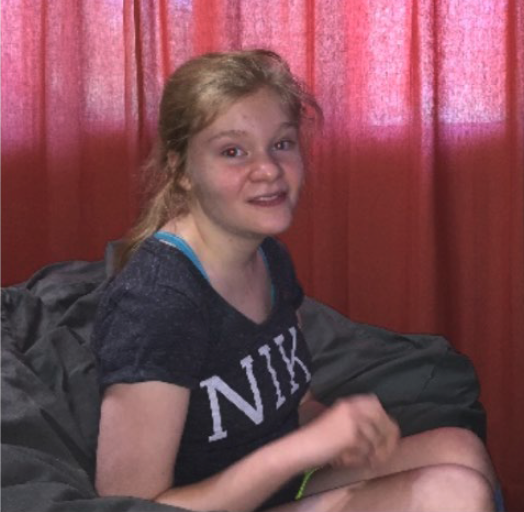
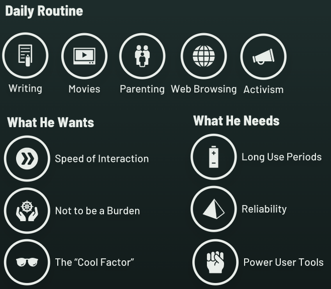
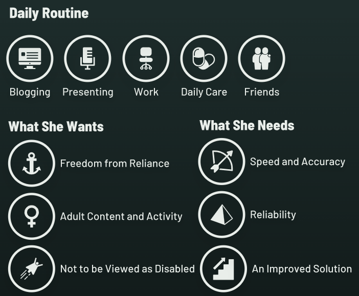
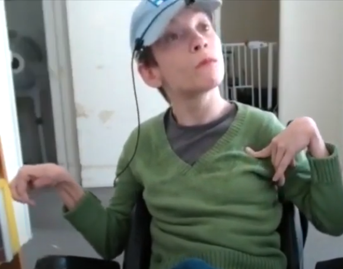
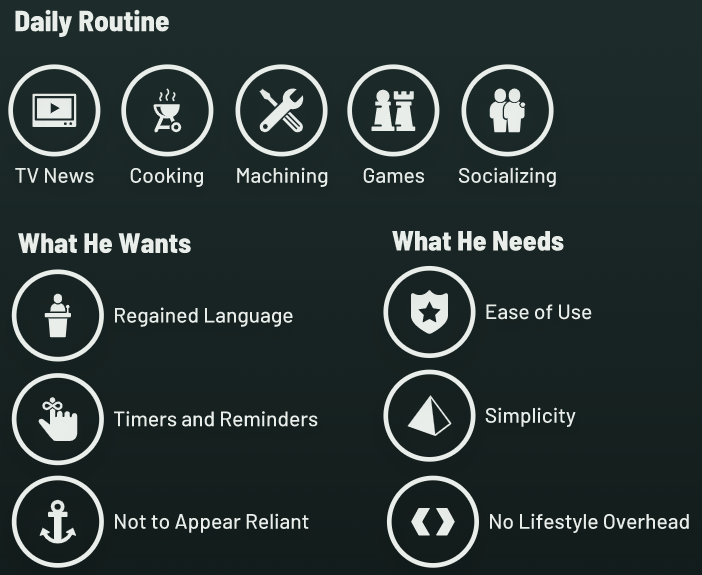
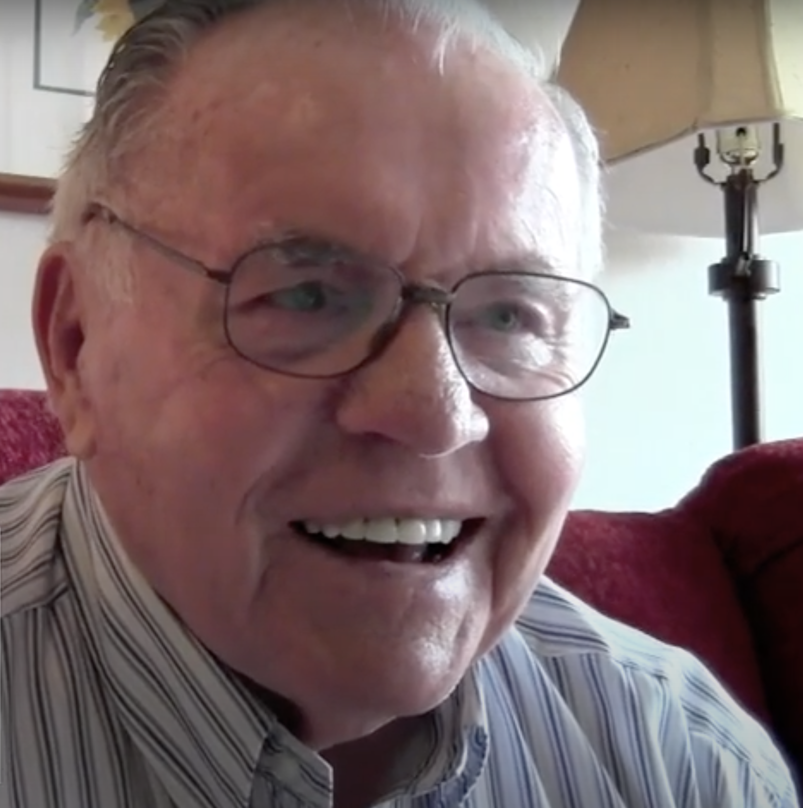
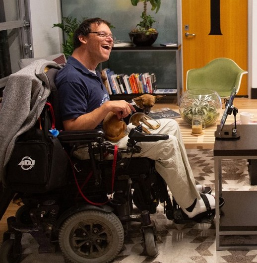

# User Personas and Use Cases

Last edited time: May 25, 2021 10:48 PM
Owner: Anonymous

**Table of Contents**

---

# Introduction

The purpose of this portion of the resource is to give those responsible for design and engineering concrete users and needs around which they can frame their thinking. In the interest of remaining grounded in our purpose, I've gone the very literal route of profiling real people with whom I have worked, either clinically or in development. Everything in the cases below is not only true but also representative of millions of others' lived experiences that are generally invisible to us in daily life.

These four cases were chosen specifically because they represent, in equal parts, both typical exact matches for our market as well as situations that border on exclusion due to unique needs. For that reason these personas are presented factually as a starting point for conversation and thought within the group, rather than as complete problem-solution pairings. The reality is that for the majority of our potential users, life is a series of problems *without* solutions; it's our job to examine their needs and determine whether we can serve them - or, if necessary, mindfully exclude them from our target cohort for this iteration. See below for media and other details, and please let me know if additional examples or information is needed.

Finally, there are a number of videos of users with a prototype AR headset at the end of the document for reference.

---

# Use Case Profiles

## Sonja, 20, Rett Syndrome

[https://www.youtube.com/watch?v=wwVtO92rQr4](https://www.youtube.com/watch?v=wwVtO92rQr4)

---

## Callan, 52, ALS

---

## Eva, 36, Cerebral Palsy

[https://www.youtube.com/watch?v=147U4ZjedkE&t=104s](https://www.youtube.com/watch?v=147U4ZjedkE&t=104s)

---

## Al, 76, Aphasia

[https://www.youtube.com/watch?v=5MPZd0MWmZI](https://www.youtube.com/watch?v=5MPZd0MWmZI)

---

# Headset Prototypes in Use

[https://vimeo.com/427391426/40dc7ecc7b](https://vimeo.com/427391426/40dc7ecc7b)

[https://vimeo.com/427391090/78b4bb2853](https://vimeo.com/427391090/78b4bb2853)

[https://vimeo.com/427391516/0372d33362](https://vimeo.com/427391516/0372d33362)

[https://vimeo.com/427391058/854938a398](https://vimeo.com/427391058/854938a398)

---

